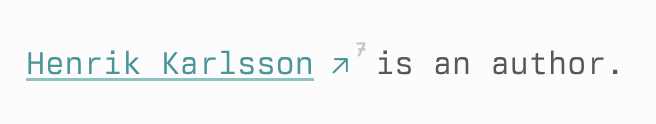

# Thymer Reference Counter

Adds inline reference counters next to record references in the editor.

Built for [Thymer](https://thymer.com/) using the [Thymer Plugin SDK](https://github.com/thymerapp/thymer-plugin-sdk).

## What it does

- Adds a small superscript count next to each inline record reference.
- Count mode based on:
  - `lines`: number of matching line-item references (`@linkto = "<guid>"`)
  - `records`: number of records that back-reference the target record
  - `combined` (default): line-item refs + property-only backref records
- Counters are display-only (non-clickable) to avoid text-flow shifts while editing.
- Includes command-palette toggles for:
  - inline counters on/off
  - hover-only display on/off
  - manual refresh
  - clearing the local count cache

## Setup

1. In Thymer, open Command Palette (`Ctrl/Cmd+P`) and choose `Plugins`.
2. Create (or open) a **Global Plugin**.
3. Paste `plugin.json` into Configuration.
4. Paste `plugin.js` into Custom Code.
5. Save once after both tabs are updated.

## Command Palette

- `Reference Counter: Toggle inline counters`
- `Reference Counter: Toggle hover-only counters`
- `Reference Counter: Refresh active page`
- `Reference Counter: Clear count cache`

## Configuration

Edit `custom` in `plugin.json`:

- `enabledByDefault` (boolean): initial state for inline counters.
- `hoverOnlyByDefault` (boolean): start with hidden-until-hover counters.
- `countMode` (`"combined" | "lines" | "records"`): counting strategy. Default is `combined`.
- `minCount` (number): only show badges at or above this count.
- `showZero` (boolean): show a badge when count is zero.
- `showSelf` (boolean): include self-references.
- `maxResults` (number): query cap when `countMode` is `lines` or `combined`.
- `cacheTtlMs` (number): local cache lifetime for computed counts.
- `refreshDebounceMs` (number): debounce delay for mutation-driven rescans.
- `opacity` (number `0.1..1`): counter opacity.
- `fontScale` (`"xsmall" | "small" | "medium" | "large"`): badge size.

## Notes

- This plugin decorates editor DOM elements and uses record-guid discovery heuristics.
- Styling is native-first: it uses Thymer text/color tokens and keeps counters visually tied to reference arrows.
- If Thymer changes editor markup in future versions, selector tuning may be needed.
- For `countMode = "lines"`, very large backlink sets are capped by `maxResults` and shown as `N+`.
- For `countMode = "combined"`, very large backlink sets are also capped by `maxResults`; when capped, the displayed value is a lower bound and shown as `N+`.

## Verification checklist

1. Open a page with several inline record references.
2. Confirm superscript counters appear beside those references.
3. Confirm counters do not push/reflow adjacent text while typing.
4. Run `Reference Counter: Toggle hover-only counters` and confirm counters hide until line hover.
5. Run `Reference Counter: Toggle inline counters` and confirm badges disappear/return.
6. Edit a reference, then verify counts refresh after a short delay.
